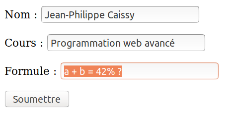
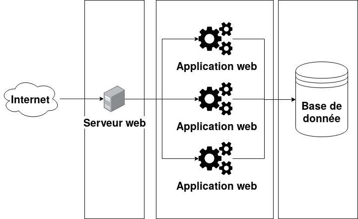
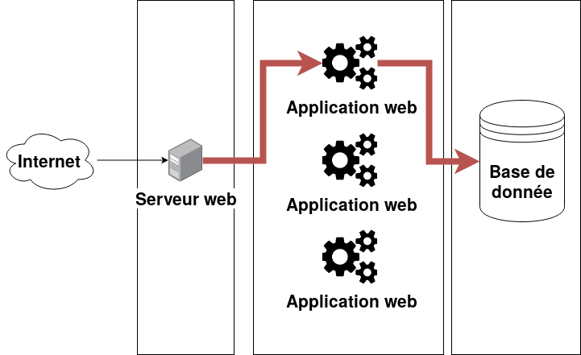
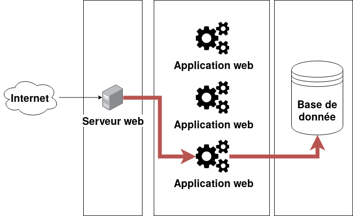
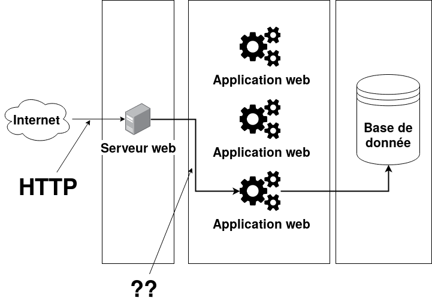
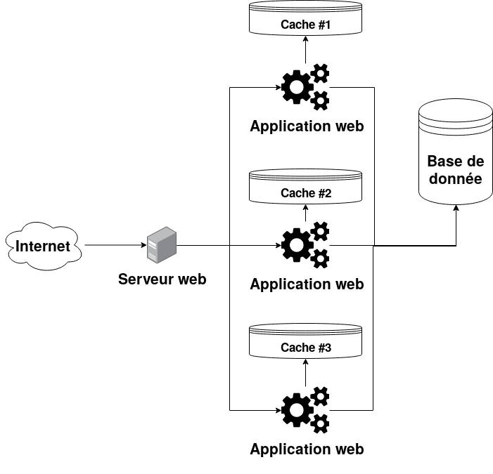
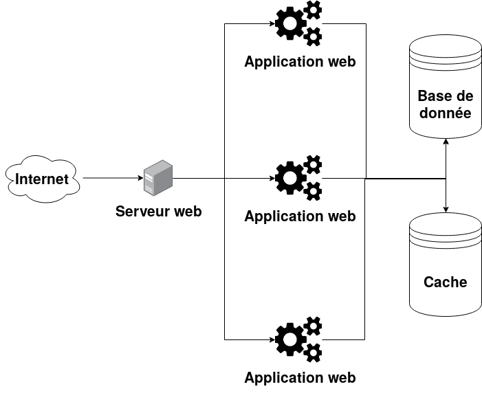

% INF5190 - Introduction aux applications webs
% Jean-Philippe Caissy
% 11 septembre 2019

# Requête HTTP

Une requête HTTP peut contenir plusieurs parties. Sous HTTP 1.1, ces deux parties sont obligatoires :

```
GET / HTTP/1.1
Host: caissy.dev
```

# Requête HTTP

```
GET / HTTP/1.1
Host: caissy.dev
```

## Ligne de début (start line)

* Méthode HTTP (GET, POST, PUT, DELETE, etc)
* URI complète demandée
* Version du protocole HTTP que le client accepte

`GET / HTTP/1.1`

`GET /ressource/1 HTTP/1.1`

`GET /ressource/1?query=toto&sort=asc HTTP/1.1`

`POST /ressource/nouveau HTTP/1.1`

# Requête HTTP
## Entêtes (headers)

La deuxième spécifie sur quel domaine (host) la requête se fait.

Un serveur web peut servir plusieurs domaines sous une seule adresse IP.

Par exemple, si un serveur web écoutant sur la même adresse IP dessert deux domaines, ces deux requêtes retournerons
les résultats différents.

```
GET / HTTP/1.1
Host: caissy.dev
```

```
GET / HTTP/1.1
Host: uqam.ca
```

# Requête HTTP
## Entêtes (headers)

### Format

Les entêtes HTTP sont une chaine représentant une clé et une valeur. La clé est le nom de l'entête,
suivis d'un double point `:` et la valeur de l'entête.

```
Host: caissy.dev
```

* Nom de l'entête : `Host`
* Valeur de l'entête : `caissy.dev`

# Requête HTTP
## Entêtes (headers)

Les entêtes permet au client (navigateur) de donner plus de précisions sur la requête actuelle.

```
GET / HTTP/1.1
Host: caissy.dev
Referer: https://etudier.uqam.ca/
User-Agent: Mozilla/5.0 (X11; Ubuntu; Linux x86_64; [..]
Accept: text/html, text/plain; q=0.6, */*; q=0.1
Accept-Encoding: gzip, deflate
Accept-Language: fr-CA, en-US, en
```


# Requête HTTP
## Entêtes (headers)
### `Referer`

* Indique au serveur Web l'origine de la requête.
* C'est souvent une autre adresse, ou vide si l'utilisateur a tapé l'adresse directement dans le navigateur.

Anecdote : `Referer` est un mot anglais mal orthographié. La bonne orthographe est `Referrer` avec deux `r`.

# Requête HTTP
## Entêtes (headers)
### `User-Agent`

* Représente l'identité du système qui fait la requête
* Exemples communs :
    * le nom du navigateur avec le système d'exploitation
    * le nom et la version de la librairie qui fait la requête
* Même s'il y a une structure définie, le format est très généreux


#### Firefox sous Ubuntu
`Mozilla/5.0 (X11; Ubuntu; Linux x86_64; rv:69.0) Gecko/20100101 Firefox/69.0`

#### Chrome sous Windows 10
`Mozilla/5.0 (Windows NT 10.0; Win64; x64) AppleWebKit/537.36 (KHTML, like Gecko) Chrome/74.0.3729.169 Safari/537.36`

# Requête HTTP
## Entêtes (headers)
### `Accept`

* Indique au serveur quel type de contenu est attendu
* Les valeurs sont séparés par des virgules
* On peut indiquer un poids de préférence à chaque format
    * Utile pour les formats de médias
    * Le serveur devrait respecter la priorité demandé par le client s'il en supporte plus d'un

#### Exemple

`Accept: text/html, text/plain; q=0.6, */*; q=0.1`

* Premier format : text/html
* Deuxième format avec un poids de 0.6 sur 1 : text/plain
* Troisième format avec un poids de 0.1 sur 1 : joker

# Requête HTTP
## Entêtes (headers)
### `Accept-Encoding`

* Indique au serveur quel type d'encodage le client supporte
    * La majorité du temps, cela représente le format de compression supporté
* Similaire à `Accept`, on peut préciser un poids sur les formats
* Valeurs souvent utilisés : `gzip`, `deflate` (zip), `br`

#### Exemple

`Accept-Encoding: br, deflate, gzip;q=0.9, *;q=0.1`

* Premier format : `br`
* Deuxième format : `deflate`
* Troisième format avec un poids de 0.9 sur 1 : `gzip`
* Quatrième format avec un poids de 0.1 sur 1 : aucun encodage


# Requête HTTP
## Entêtes (headers)
### Encodage

Le protocole HTTP est un protocole texte. Selon la [spécification RFC 2616](http://www.ietf.org/rfc/rfc2616.txt), seul
les caractères ASCII sont autorisés.

Le nom des entêtes HTTP ne sont pas sensible à la case :

```
GET / HTTP/1.1
host: caissy.dev
ACCEPT: text/html, text/plain
```

```
GET / HTTP/1.1
hoST: caissy.dev
ACCept: text/html, text/plain
```

Sont deux requêtes valides et identiques.

# Requête HTTP
## Entêtes (headers)
### Encodage

Puisque le nom et la valeur des entêtes ne peuvent que contenir des caractères ASCII, on doit encoder les caractères
qui ne sont pas dans la table ASCII.

#### Encodage pourcentage des URI

Si un URI contient des caractères non-ASCII, ils doivent être encodés de la manière suivante :

`
Pourcentage (%) + deux chiffres hexadécimales représentant l'identifiant
`

De plus, l'espace est représenté par le signe plus `+`.

# Requête HTTP
## Entêtes (headers)
### Encodage
#### Encodage pourcentage des URI

`caissy.dev/ressource intéractive #20/info/`

devient :

`caissy.dev/ressource+int%C3%A9ractive+%2320/info/`

| Caractère | Représentation hexadécimale | Valeur d'encodage  |
|-----------|-----------------------------|--------------------|
| `(espace)`  |                             | `+`                  |
| `é`         | `C3A9` (unicode)              | `%C3%A9`             |
| `#`         | `23` (table ascii)            | `%23`                |

* N.B. : Sous Linux, la commande `man ascii` vous affiche un tableau des représentations hexadécimales et
décimales de la table ascii

# Requête HTTP
## Entêtes (headers)
### Entêtes propriétaires

* La plupart des entêtes sont standardisés et expliqués dans la spécification du protocole HTTP
* On peut envoyer n'importe quel autre entête en suivant le format `X-` suivit du nom de l'entête
    * Ex : `X-Mon-Entete-Speciale`
* Les utilisations sont variés, et propre à l'implémentation du client et/ou serveur
    * Ex : authentification par clé d'api (`X-Api-Key`)

# Requête HTTP
## Envoie d'un corps de requête

* Lors de requêtes `GET`, le client n'envoie pas de corps (_body_) à la requête
* Les formats `POST`, `PUT` permettent au client d'envoyer des données additionnelles pour être interprété par le
serveur
* Il existe des formats définie dans le protocole HTTP :
    * Représente une structure de donnée clé-valeur
    * Format de base lorsque les données de formulaire est envoyé dans la requête
    * Ex : `application/x-www-form-urlencoded`


# Requête HTTP
## Envoie d'un corps de requête
### Format

* Le format réutilise l'encodage pourcentage
* Format clé-valeur séparé par un `&` :
    * `cle=valeur&cle_2=valeur_2`
    * `prenom=jean-philippe&nom=caissy`
    * `prenom=jean-philippe&nom=caissy&cours=inf5190`

# Requête HTTP
## Envoie d'un corps de requête

{ width=50% }\

se traduit par :

```
nom: Jean-Philippe Caissy
cours: Programmation web avancé
formule: a + b = 42 % ?
```

qui est encodé par :

```
nom=Jean-Philippe+Caissy&cours=Programmation+web+
avanc%E9&formule=a+%2B+b+%3D+42%25+%3F
```

# Requête HTTP
## Envoie d'un corps de requête

```
POST /formulaire HTTP/1.1
Host: caissy.dev
Content-Type: application/x-www-form-urlencoded
Content-Length: 87

nom=Jean-Philippe+Caissy&cours=Programmation+web+
avanc%E9&formule=a+%2B+b+%3D+42%25+%3F
```

# Requête HTTP
## Envoie d'un corps de requête
### `Content-Length`

* Nouvel entête!
* Précise au serveur web la taille en octet du cours (_body_) qui sera envoyé

# Réponse HTTP

Une fois que le serveur web a reçu et traiter la requête, il renvoie une réponse.

* Le format est le même que pour la requête:
    * Ligne de début
    * Liste d'entêtes
    * Contenu de la réponse (peut être vide)


# Réponse HTTP

Requête :
```
GET /jpcaissy/inf5190 HTTP/1.1
Host: github.com
```

Réponse :
```
HTTP/1.1 200 OK
Server: GitHub.com
Date: Tue, 10 Sep 2019 01:12:40 GMT
Content-Type: text/html; charset=utf-8
[...] d'autres entêtes

<!DOCTYPE html>
<html lang="en">
  <head>
[...]
```

# Réponse HTTP
## Ligne de début (start line)

* Version du protocole HTTP que le serveur utilise
* Code du statut HTTP retourné
* Description du statut HTTP

# Réponse HTTP
## Ligne de début (start line)
### Statut HTTP

* `2XX` : Succès
* `3XX` : Redirection
* `4XX` : Erreur causé par le client
* `5XX` : Erreur de serveur

# Réponse HTTP
## Ligne de début (start line)
### Statut HTTP

* `2XX` : Succès

| Code | Nom | Description |
|-----------|-----------------------------|--------------------|
| `200` | `OK` | La requête a été traitée avec succès |
| `201` | `Created` | Une nouvelle ressource a été créé (`POST`, `PUT`) |
| `202` | `Accepted` | La requête a été reçu, mais n'a pas été traitée |
| `204` | `No Content` | Il n'y a pas de contenu (_body_) à la réponse |

# Réponse HTTP
## Ligne de début (start line)
### Statut HTTP

* `3XX` : Redirection

| Code | Nom | Description |
|-----------|-----------------------------|--------------------|
| `301` | `Moved Permanently` | Changement permanent de la ressource demandée |
| `302` | `Found` | Changement temporaire (redirection) |
| `304` | `Not Modified` | Aucun changement à la ressource, le client utilise sa cache |

# Réponse HTTP
## Ligne de début (start line)
### Statut HTTP

* `4XX` : Erreur causé par le client

| Code | Nom | Description |
|-----------|-----------------------------|--------------------|
| `400` | `Bad Requset` | Le client a envoyé une mauvaise requête |
| `401` | `Unauthorized` | Le client doit s'authentifier en premier |
| `403` | `Forbidded` | Le client n'a pas la bonne authentification |
| `404` | `Not Found` | La ressource n'existe pas |
| `405` | `Method not allowed` | La méthode HTTP n'est pas supportée |

# Réponse HTTP
## Ligne de début (start line)
### Statut HTTP

* `5XX` : Erreur de serveur

| Code | Nom | Description |
|-----------|-----------------------------|--------------------|
| `500` | `Internal Serveur Error` | Erreur interne du serveur |
| `503` | `Service Unavailable` | Le serveur n'est pas prêt |

# Réponse HTTP
## Entêtes (headers)
### `Content-Type`

```
Content-Type: text/html; charset=utf-8
```


* Précise le type du contenu retourné
* Optionnellement peut contenir le type d'encodage des caractères (_charset_)
    * Devrait correspondre à l'une des valeurs envoyé par le client avec `Accept`


#

{ width=80%}

# État d'une application web

* Une application web est dit sans état (_stateless_)
* Par défaut, chaque requête HTTP est indépendante l'une de l'autre
    * Le serveur web ne conserve pas l'état d'une connexion d'une requête web
* C'est comme si on lançait l'application à chaque requête

Comment un état peut-il être partagé entre des requêtes ? Comment est-ce qu'un utilisateur connecté peut-il
naviguer tout en restant connecté?

On doit permette à une application de représenter une session en cours.

# État d'une application web
## Solution naïve

Puisqu'on peut transmettre de l'information avec les paramètres de l'URL, on pourrait toujours ajouter l'information
nécessaire.

Ex : https://github.com/jpcaissy/inf5190?username=jpcaissy&password=toto123

* **Non sécuritaire** : le mot de passe est en clair, et persisté dans l'historique du navigateur
* Nécessite une implémentation propre au client
* Peut devenir rapidement complexe et très propice à des erreurs et/ou oublies
    * ex: si on oublie de le rajouter à un lien, l'utilisateur ne sera pas connecté

**_Mauvaise solution !_**

# État d'une application web
## Cookie

Le protocole HTTP offre une solution : les cookies

* De l'information généré par le serveur et stocké sur le client (navigateur)
* Cette information est retransmise à chaque requête (**rejouable**)
    * ex: contenu d'un panier d'achat, les pages visités
* L'information _peut_ être accessible seulement par le serveur web (**sécuritaire**)
    * Ce qui veut dire qu'un script client n'aurait jamais accès à cette information
* Le cookie peut posséder une date d'expiration
* On peut définir une portée sur la ressource applicable par le cookie
    * ex: le cookie est valide seulement pour la page `/jpcaissy/inf5190`, mais pas `/uqam`

# État d'une application web
## Cookie
### Utilisation

* Gestion de session
* Personnalisation d'un site Web
* Suivi et marketing (_tracking_)

# État d'une application web
## Cookie

Les cookies sont retournés par le serveur web dans les entêtes de réponse d'une requête.

```
HTTP/1.1 200 OK
Content-Type: text/html; charset=utf-8
Set-Cookie: miam_cookie=chocolat
Set-Cookie: meilleurs_cookies=framboise
```

### Format

```
Set-Cookie: <nom-du-cookie>=<valeur-du-cookie>
```

# État d'une application web
## Cookie

Une fois que le client a reçu le cookie, à chaque requête il va ajouter un entête de plus.

```
GET / HTTP/1.1
Host: caissy.dev
Cookie: miam_cookie=chocolat; meilleurs_cookies=framvoise
[...]
```

### Cookie de session

Dans l'exemple ci-haut, les cookies sont de type session. Ils seront supprimés lorsque le navigateur sera fermé.

C'est un cas d'utilisation parfait pour gérer la session d'un utilisateur connecté à une application web.

# État d'une application web
## Cookie
### Cookie persistés

Il est possible d'utiliser de persister le cookie et préciser une date d'expiration (`Expires`), ou une limite de temps
spécifique (`Max-Age`).

`
Set-Cookie: meilleurs_cookies=framboise; Expires: Mon, 23 Sep 09:00:00 GMT;
`

# État d'une application web
## Cookie
### Sécurité des cookies

Par défaut, les cookies sont accessible sur le navigateur avec Javascript (`document.cookie`).

Dans certain cas c'est acceptable, mais dans d'autres non!

Par exemple : les informations d'authentification ne devraient pas être accessible par le Javascript côté client

Le paramètre `HttpOnly` permet d'empêcher à Javascript de lire un cookie spécifique.

```
Set-Cookie: meilleurs_cookies=framboise; Secure;
```

# État d'une application web
## Cookie
### Sécurité des cookies

Une autre protection est de ne seulement transmettre les cookies lorsque la connexion est sécurisé avec `https`.
Cela empêche un utilisateur malveillant d'espionner vos cookies.

Dans ce cas-ci on va utiliser le paramètre `Secure`.

```
Set-Cookie: meilleurs_cookies=framboise; HttpOnly;
```

# État d'une application web
## Cookie
### Sécurité des cookies

Par défaut, il est important de **toujours** sécuriser les cookies avec `HttpOnly` et `Secure`. Cela empêche
d'éliminer plusieurs vecteurs d'attaques communs à des applications web.

```
Set-Cookie: meilleurs_cookies=framboise; Secure; HttpOnly;
```

Note : on va repasser sur ces concepts plus en profondeur lorsqu'on sera rendu à la sécurité des applications web.

# État d'une application web
## LocalStorage

HTML5 introduit une nouvelle API qui permet de stocker de l'information sur le client avec Javascript.

N.B. : Il existe `sessionStorage` qui a les mêmes fonctionnalités, mais qui dont le contenu est supprimé lorsque le
navigateur est fermé.

# État d'une application web
## LocalStorage
### API Javascript

```javascript
var storage = window.localStorage;
//            ^--- ou window.sessionStorage
storage.setItem('meilleurs_cookies', 'framboise');

var meilleurs_cookies = storage.getItem('meilleurs_cookies');
console.log(meilleurs_cookies); // Affiche framboise

storage.removeItem('meilleurs_cookies');
storage.clear();
```

# Application web
## Fonctionnement n-tier

Les applications web sont considérés comme des applications _n-tier_.

C'est-à-dire, il y a plusieurs couches responsables du fonctionnement.

Il s'agit communément d'une application à 3 tiers :

1. Serveur web qui est la porte d'entrée (ouvert sur le monde)
2. Application (Python, Java, PHP, etc) qui décode la requête
3. Système de stockage de données (base de données)

# Application web
## Fonctionnement n-tier

{width=50%}

* Le serveur web agit comme balanceur de charge. Il distribue les requêtes à chacun des serveurs applicatifs.
* Il existe N application web
* Il peut y avoir plus d'une base de donnée en fonction des besoins

# Application web
## Balanceur de charge

{width=50%}

# Application web
## Balanceur de charge

{width=50%}

# Application web
## Balanceur de charge
### Rôle

* Distribuer le trafique d'une application à travers plusieurs serveurs
* Assure une haute disponibilité en routant le trafique seulement aux applications webs en ligne
* Permet la flexibilité de supprimer ou rajouter des applications web sans interruption

# Application web
## Balanceur de charge
### Algorithme de routage

* **Round-Robin** (chacun son tour) : le trafique est distribué de manière séquentielle
* **Nombre de connexion** : envoie le trafique à l'application web avec le moins de connexions ouvertes
* **Temps de réponse** : envoie le trafique à l'application web dont le temps de réponse est le plus cours
* **Table de hashage** : Utilise l'adresse IP comme hash pour déterminer le serveur application

# Application web
## Balanceur de charge
### Exemples de balanceur de charge applicatif

* NGINX
* Apache
* HAProxy


### Exemples de balanceur de charge physiques (hardware):

* Cisco
* F5

# Application web

{width=50%}

# Application web
## Protocole de communication entre le serveur web et l'application web

Il existe deux méthodes pour un serveur web de communiquer avec l'application web :

* Utiliser le protocole HTTP directement
* Utiliser un protocole ou une interface distincte
    * CGI/FastCGI
    * Python : WSGI
    * Ruby : Rack

#Application web
## Protocole de communication entre le serveur web et l'application web
### CGI/FastCGI

* Interface de base
* Une requête web = une exécution complète de l'application
* Les entêtes HTTP sont passés par des variables d'environnements
* Peu performant : pour chaque requête web, il faut exécuter l'application au complet
    * Aucune réutilisation possible, car l'application est terminée après la requête
* Chaque requête web est indépendante car l'application est terminée après l'exécution
* FastCGI est une extension où le processus de l'application web est réutilisée

#Application web
## Protocole de communication entre le serveur web et l'application web
### HTTP

L'application web intègre un serveur web et elle communique directement avec le protocole HTTP.

[Exemple de code disponible dans `exemples/serveur-web-simple.py`](exemples/serveur-web-simple.py)

```
$ python3 exemples/serveur-web-simple.py
Démarage du serveur HTTP sur le port 8080 (http://localhost:8080)
```

```
$ curl -i localhost:8080
HTTP/1.0 200 OK
Server: BaseHTTP/0.6 Python/3.6.8
Date: Tue, 10 Sep 2019 18:11:17 GMT
Content-Type: text/html; charset=utf-8

<html><body><h1>Hello World!</h1></body></html>
```

#Application web
## Protocole de communication entre le serveur web et l'application web
### HTTP

Souvent **non recommandé** comme porte d'entrée.

* Pas optimisé pour un grand trafique.
    * Les serveurs et balanceurs de charge HTTP peuvent facilement gérer des dizaines de milliers de connections à la seconde
* Possible de mettre derrière un balanceur de charge par contre
* Serveur HTTP populaire :
    * Gunicorn
    * Tornardo
    * Waitress
    * uWSGI

#Application web
## Protocole de communication entre le serveur web et l'application web
### WSGI

Historiquement, il n'existait aucune interface standard entre un serveur web et une application web.

* WSGI est une interface simple et universelle définie par une spécification Python (PEP 333)
* Une application web qui respecte l'interface WSGI peut utilisé n'importe quel serveur HTTP
* L'application est exposée comme objet respectant l'interface de WSGI
    * Le serveur invoque cet objet à chaque requête HTTP

N.B. : WSGI à lui seule ne fait rien. Ce n'est qu'une interface standardisée

#Application web
## Protocole de communication entre le serveur web et l'application web
### WSGI

```python
# exemples/app-wsgi.py
def application(env, start_response):
    start_response('200 OK', [('Content-Type','text/html')])
    return [b"<html><body><h1>Hello World</h1></body></html>"]
```

```
$ gunicorn3 -b :8080 app-wsgi:mon_application
Starting gunicorn 19.7.1
Listening at: http://127.0.0.1:8080 (17387)
Using worker: sync
Booting worker with pid: 17390

```

```
$ curl localhost:8080
<html><body><h1>Hello World</h1></body></html>
```

#Cache applicative

Un concept clé du développement d'applications performantes est l'utilisation de cache.

Une cache mémoire permet de récupérer **rapidement** de l'information qui est souvent demandée et change rarement.

Exemples d'utilisations :

* Les informations de profil (nom, prénom, avatar) d'une personne connectée
    * Sur chaque page de l'application Web, ces informations sont affichées
* Le contenu d'un panier d'achat sur un site de commerce en ligne
    * Le nombre d'item d'un panier d'achat est affiché sur chaque page

#Cache applicative

Une cache applicative peut être globale ou par session :

* Globale : le contenu d'une page qui ne change pas en fonction du visiteur
* Session : les informations de la cache sont dépendants de la session actuelle

#Cache applicative
## Session

On peut associer chaque nouvelle session à un cookie.

Lors d'une première visite, on génère un identifiant unique. Cet identifiant est retourné dans un cookie :

```
HTTP/1/ 200 OK
[...]
Set-Cookie: session=0d20cc49117; HttpOnly; Secure;
```

De cette manière, nous lions une session HTTP avec un cookie. Le navigateur va toujours transmettre la valeur de
ce cookie aux requêtes HTTP subséquentes.

#Cache applicative
## Session

[Exemple de code disponible dans `exemples/cookie-session.py`](exemples/cookie-session.py)

```
$ gunicorn3 -b :8080 cookie-session:mon_application
Starting gunicorn 19.7.1
Listening at: http://127.0.0.1:8080 (22277)
Using worker: sync
Booting worker with pid: 22280
```

```
$ curl -H "Cookie: session=123456;" localhost:8080
Hello World!
Session : 123456
Nombre de visite(s) : 1

$ curl -H "Cookie: session=123456;" localhost:8080
Hello World!
Session : 123456
Nombre de visite(s) : 2
```

#Cache applicative
## Session

[Exemple de code disponible dans `exemples/cookie-session.py`](exemples/cookie-session.py)
```
$ gunicorn3 -b 0.0.1:8080 cookie-session:mon_application
[...]
```

```
$ curl -H "Cookie: session=987654;" localhost:8080
Hello World!
Session : 987654
Nombre de visite(s) : 1
```

```
$ curl -H "Cookie: session=123456;" localhost:8080
Hello World!
Session : 987654
Nombre de visite(s) : 3
```

#Cache applicative
## Session

### Cookie inexistant (première visite)

1. Générer un identifiant de session aléatoire
2. Initialiser la cache pour cette session
3. Retourner l'identifiant de session avec un cookie

### Cookie existant (visite subséquante)

1. Récupérer la session dans la cache grâce à l'identifiant de session
2. Modifier la cache au besoin
3. Retourner l'identifiant de session avec un cookie

#Cache applicative
## Session

Deux problèmes :

1. La cache n'est pas persisté : si on relance l'application web on perd la cache
2. La cache n'est pas partagée entre les différents applications web

#Cache applicative
## Session
### Cache persisté

* Cache qui est persisté à chaque requête
* Peut être fait par l'application web elle même

#Cache applicative
## Session
### Cache distribuée

{width=50%}

#Cache applicative
## Session
### Cache distribuée

Une cache qui est partagée entre toutes les applications web

{width=50%}

#Cache applicative
## Session
### Cache distribuée

* Une cache distribuée est un système à part de l'application web qui s'occupe de stocker des informations.
* Peut être une base de donnée relationnelle
* Mieux si c'est un engin de stockage clé-valeur car plus performant :
    * Ex : Redis, Memcached

#Cache locale

Le protocole HTTP permet au navigateur de cacher des pages entières.

* La cache HTTP est optionnelle
* Réutiliser une ressource HTTP déjà reçu est mieux (plus rapide)
* Souvent limiter aux requêtes `GET` : les autres ont souvent des effets de bords (changement de la ressource)
* Utilisé majoritairement pour les pages qui changent rarement et les ressources statiques (CSS, JS, images)

#Cache locale
## Contrôle de la cache

L'entête HTTP `Cache-Control` donne les directives de caching au navigateur.

### Ne pas cacher la page

`Cache-Control: no-store`

Indique qu'on ne veut jamais que la page soit caché par le navigateur

### Expiration

`Cache-Control: max-age=86400`

Permet à la ressource d'être caché pour un nombre de secondes. Indique que la page peut être caché pour une journée (86,400 secondes)


# La semaine prochaine

## Apportez votre ordinateur portable !

Nous allons voir des exemples de codes dans le cours.

* Architecture d'une application web
* Introduction à Flask

#

## Liens utiles :

* [Exemples de code](https://github.com/jpcaissy/INF5190/cours/02-sept-11/exemples)
* [HTTP Messages](https://developer.mozilla.org/en-US/docs/Web/HTTP/Messages)
* [HTTP Cookies](https://developer.mozilla.org/en-US/docs/Web/HTTP/Cookies)
* [HTTP Caching](https://developer.mozilla.org/en-US/docs/Web/HTTP/Caching)

## Bibliographie

* Figure \ref{http-structure} : [_Requests and responses share a common structure in HTTP_](https://developer.mozilla.org/en-US/docs/Web/HTTP/Messages$revision/1555323) par [_Teoli_](https://developer.mozilla.org/en-US/profiles/teoli) sous licence [CC-BY-SA 2.5](https://creativecommons.org/licenses/by/2.5/)
