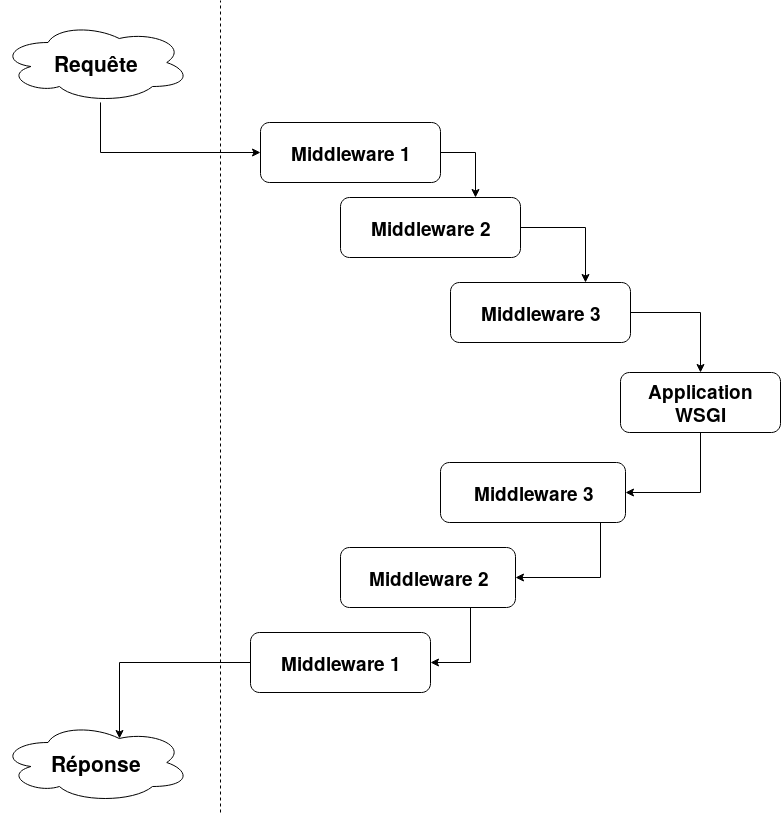
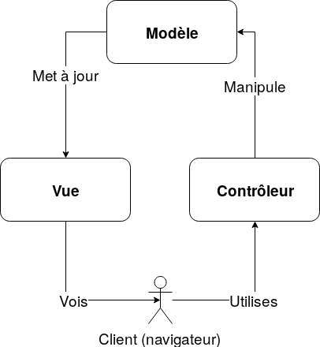

% INF5190 - Architecture d'applications Web
% Jean-Philippe Caissy
% 18 septembre 2019

# Développement _frontend_ et _backend_

En ingénierie logicielle, les termes _frontend_ et _backend_ différencient la séparation de responsabilité d'un
logiciel par rapport à sa couche de présentation (**front**) et sa couche d'accès de données (**back**).

Dans un modèle client-serveur, tel que les applications web, le client est souvent reconnu comme étant le _frontend_ 
et le serveur le _backend_.

Dans le cadre de ce cours, nous nous concentrons sur le développement _backend_.

# Mécanismes de communications
## Patrons de communications

* Un patron d'échange de communications définit comment les informations sont échangés pour établir un canal de communication
* Il existe deux grandes familles :
    * Patron requête-réponse (_request-response_)
    * Patron unidirectionnel (_one-way_)
    * Patron publier-s'abonner (_publish-subscribe_)

* Le protocole HTTP utilise le patron requête-réponse, et le protocole UDP est un patron unidirectionnel

# Mécanismes de communications
## Patrons de communications
### Synchrone et asynchrone

* Le patron requête-réposne est un moyen de communication synchrone :
    * Une requête est envoyé et une réponse est attendue
* À l'inverse les patrons à unidirectionnel (one-way) ne sont pas synchrone
    * Lorsqu'un paquet UDP est envoyé, il n'y a aucun accusé de réception

# Mécanismes de communications
## Patrons de communications
### Synchrone et asynchrone

{width=70%}

# Mécanismes de communications
## Patrons de communications
### Synchrone et asynchrone

{height=90%}

# Mécanismes de communications
## Patrons de communications
### Publier-s'abonner (_publish-subscribe_)

* Mécanisme de publication de message
* Le diffuseur (_publisher_) n'envoie pas à des destinataires (_subscriber_) spécifiques
* De la même manière, un destinataire (_subscriber_) n'est pas au courant des diffuseurs
* Les communications sont groupés en catégorie.
    * Un destinataire peut écouter sur plusieurs catégories
    * Un diffuseur peut envoyer sur plusieurs catégories

# Mécanismes de communications
## Patrons de communications
### Publier-s'abonner (_publish-subscribe_)

{width=70%}

# Fonctionnement interne

1. Requête entrante
2. Exécution des middlewares
3. Routage vers la méthode
4. Exécution de la méthode pour la requête
5. Récupération et/ou modifications des données persistées
6. Bâtir la réponse
7. Retourner la réponse Web

# Fonctionnement interne
## Requête entrante

* Récupération de la requête Web
* Instanciation de l'environnement WSGI `environ`
* Invocation de l'application Web (WSGI)

```python
def application(environ, start_response):
    start_response('200 OK', [
        ('Content-Type': 'text/plain')
    ])
    return b"Hello World!\n"
```


# Fonctionnement interne
## Intergiciel (_middleware_)

* Un middleware est une composante logiciel créant un réseau d'échanges d'informations
* Un ou plusieurs middleware peuvent interagir avec une requête Web
* Agit comme un bus de communication
* Peut interrompre une requête (i.e.: authentification)

Exemples d'utilisations :

* Écrire une ligne de log pour chaque requête
* Rajouter des informations de sessions et d'authentification
* Gestion des connexions externes (e.g.: base de donnée)
* Mettre les paramètres de sécurités par défaut
* etc...

# Fonctionnement interne
## Intergiciel (_middleware_)



# Fonctionnement interne
## Intergiciel (_middleware_)
### Exemple WSGI

[./exemples/middleware-wsgi.py](./exemples/middleware-wsgi.py)

```python
import waitress

class LogRequest(object):
    def __init__(self, app):
        self.app = app
    def __call__(self, environ, start_response):
        path = environ['PATH_INFO']
        print("Request for {0}".format(path))
        return self.app(environ, start_response)

def app(environ, start_response):
    start_response('200 OK', [('Content-Type', 'text/plain')])
    return [b'Hello, world!\n']

waitress.serve(LogRequest(app), port=8080)
```

# Fonctionnement interne
## Intergiciel (_middleware_)
### Exemple WSGI

```
$ curl http://127.0.0.1:8080/
Hello, world!
$ curl http://127.0.0.1:8080/toto
Hello, world!
$ curl http://127.0.0.1:8080/foobar
Hello, world!
```

```
$ python exemples/middleware-wsgi.py
Serving on http://0.0.0.0:8080
Request for /
Request for /toto
Request for /foobar
```

# Fonctionnement interne
## Routage vers la méthode

Objectif : déterminer la méthode qui va gérer la requête

| URI | Méthode HTTP | Nom de méthode |
|-----|--------------|----------------|
| `/` | GET | `index` |
| `/ressource` | GET | `ressource_index` |
| `/ressource` | POST | `ressource_new` |
| `/ressource/1` | GET | `ressource` |
| `/ressource/1` | DELETE | `ressource_delete` |

# Fonctionnement interne
## Routage vers la méthode

Expressions régulières

| Expression régulière | Méthode HTTP | Nom de méthode |
|-----|--------------|----------------|
| `^\/$` | GET | `index` |
| `^\/ressource$` | GET | `ressource_index` |
| `^\/ressource$` | POST | `ressource_new` |
| `^\/ressource\/(?P<id>\d+)$` | GET | `ressource` |
| `^\/ressource\/(?P<id>\d+)$` | DELETE | `ressource_delete` |

# Fonctionnement interne
## Routage vers la méthode

```
^\/ressource\/(?P<id>\d+)$
```

1. **`^`** : début de chaine
2. **`\/ressource\/`** : littéralement `/ressource/` (un doit escaper le *`/`*)
3. **`(?P<id>\d+)`** : capture de groupe nommée **`id`** pour un ou plusieurs entiers **`\d+`**
4. **`$`** : fin de chaine

# Fonctionnement interne
## Routage vers la méthode

```python
>>> import re
>>> uri = "/ressource/321"
>>> regex = "^\/ressource\/(?P<id>\d+)$"
>>> matches = re.search(regex, uri)
>>> matches['id']
'321'
```

# Fonctionnement interne
## Routage vers la méthode

```python
routing = [('^\/$', 'GET', index),
    ('^\/ressource$', 'GET', ressource_index),
    ('^\/ressource$', 'POST', ressource_new),
    ('^\/ressource\/(?P<id>\d+)$', 'GET', ressource),
    ('^\/ressource\/(?P<id>\d+)$', 'DELETE', ressource_delete)]

def application(environ, start_response):
    for regex, http_method, method in routing:
        if environ['REQUEST_METHOD'] == http_method:
            if re.matches(regex, method):
                method(environ, start_response)
```

# Fonctionnement interne

4. Exécution de la méthode pour la requête
5. Récupération et/ou modifications des données persistées
6. Bâtir la réponse

**MVC : Modèle-Vue-Contrôleur**


# Fonctionnement interne
## MVC

* Patron de conception pour les interfaces graphiques
* Division l'application en trois modules :
    * Modèle (_model_)
    * Vue (_view_)
    * Contrôleur (_controller_)
* Permet de séparer la présentation et la réception d'information du client (navigateur)

Objectifs principaux :

* Assure une réutilisation saine du code
* Permet le développement simultané avec plusieurs personnes 

# Fonctionnement interne
## MVC

{ width=50% }

# Fonctionnement interne
## MVC

Avantages :

* Développement simultané par une équipe des différentes composantes
* Forte cohésion dû au regroupement logique des actions dans un contrôleur et des vues
* Faible couplage entre les trois composantes
* Maintenance simplifiée grâce à la séparation des responsabilités

Désavantages :

* Navigation du code plus complexe : une nouvelle couche d'abstraction
* Courbe d'apprentissage prononcée
* Originalement pour les interfaces graphiques

# Fonctionnement interne
## MVC

### Modèle

Contient les données applicative et responsable de la gestion et de la logique des données : lecture, persistage/stockage et validation

### Vue

Partie visible au navigateur. Utilise les données récupérées par le modèle pour construire une page Web.

### Contrôleur

Gère les requêtes Web, traite les actions et modifie les données du modèle et de la vue

# Fonctionnement interne

4. Exécution de la méthode pour la requête : **Contrôleur**
5. Récupération et/ou modifications des données persistées : **Modèle**
6. Bâtir la réponse : **Vue**

# Cadriciels (_frameworks_) de développement

* Un cadriciel de développement Web est une librairie sous la forme d'une collection d'outils offrant les 
fonctionnalités communes au développement d'applications Web
* Permet le développement d'applications :
    * **Fiable** : ré-utilisation de concepts existants et prouvés
    * **Flexible** : utilisation de fonctionnalités communes pré-existantes selon les besoins
    * **Évolutif** : changements incrémentiels constants
    * **Maintenable** : patrons de conception connus et déjà utilisés

# Fonctionnalités communes

* Routage des ressources (URL)
* Gestion des données et validations d'erreurs
* HTML, XML, JSON, etc
* Gestion des connexions et interactions de base de donnée
* Sécurité Web : CSRF, Injection SQL, XSS, etc
* Gestion de sessions et authentifications

Liste non exhaustive, certains cadriciels incluent plus, ou moins de fonctionnalités. Le niveau de couplage entre
les différentes librairies est propre à chaque cadriciel.

# Objets de services

Un controlleur devrait simplement être responsable de gérer les requêtes. Le traitement de celles-ci sont souvent
relégués à des objets de services.

**Objet de service** : Un objet qui encapsule une ou plusieurs opérations du domaine d'affaire de l'application.

Les objets de services sont utilisés pour alléger le contenu d'un contrôleur.

Exemple : Un contrôleur est instancié pour enregistrer un nouvel utilisateur. L'enregistrement de l'utilisateur
(i.e. : écriture dans la base de donnée, envoie du courriel de bienvenue, etc) est géré par un objet de service.

[Exemple sur Github](https://github.com/jpcaissy/INF5190/tree/master/cours/03-sept-18/exemples/poll/services.py)

# Traitement d'une requête POST
## Problème

{width=80%}

# Traitement d'une requête POST

Traitement d'une requête Web de type POST:

* Le client envoie la requête Web
* L'application reçoit la requête et traite la requête
* S'il y a une erreur : l'exécution est interrompu et l'erreur est retourné par l'application
* S'il n'y a pas d'erreurs : l'application retourne un code de redirection (`303 See Other`) et le navigateur charge cette nouvelle page

**Post-Redirect-Get**

# Traitement d'une requête POST
## Post-Redirect-Get

Objectif principal : 

* Empêcher les soumissions multiples de formulaires sur une page Web
* Aider le fonctionnement de navigation (i.e.: page précédente) du navigateur

# Traitement d'une requête POST
## Post-Redirect-Get

{height=60%}


# Flask

Cadriciel (_framework_) de développement Web

* Léger et simpliste
* Facile à utiliser
* Flexible et n'enforce aucune structure rigide

# Flask
## Hello World!

```python
from flask import Flask

app = Flask(__name__)

@app.route('/')
def hello_world():
    return '<h1>Hello World!</h1>'
```

```
$ FLASK_APP=flask_app.py flask run
 * Serving Flask app "flask_app.py"
 * Environment: production
   WARNING: This is a development server. Do not use it in a production deployment.
   Use a production WSGI server instead.
 * Debug mode: off
 * Running on http://127.0.0.1:5000/ (Press CTRL+C to quit)
```

# Flask
## Décorateurs de méthodes

Annotations de méthodes.

```python
>>> def bold(func):
        return "<b>" + func() + "</b>"

>>> def say_weeee():
        return "Weeee!"

>>> bold(say_weeee)
'<b>Weeee!</b>'
```

# Flask
## Décorateurs de méthodes

```python
>>> def bold(func):
...     def wrapped():
...             return f"<b>{func()}</b>"
...     return wrapped
>>> @bold
... def say_hello_world():
...     return "Hello World!"
...
>>> say_hello_world()
'<b>Hello World!</b>'
```

# Flask
## Routage statique

Afin de suivre le modèle MVC, chaque routes est associé à un contrôleur – une méthode Python.

Lors d'une requête Web, Flask va trouver la route qui correpond à la requête et appeler la méthode lié.

```python
@app.route('/')
def index():
    return "Page d'accueil"

@app.route('/hello')
def hello():
    return 'Hello world!'
```

# Flask
## Routage variable

Flask permet d'ajouter des variables et de les exposer au contrôleur.

```python
from flask import Flask, escape

@app.route('/utilisateur/<username>')
def afficher_profile(username):
    # Afficher le profile d'un utilisateur
    return 'Utilisateur {0}'.format(escape(username))

@app.route('/messages/<int:message_id>')
def afficher_message(message_id):
    return 'Message {0}'.format(mesasge_id)
```

# Flask
## Routage par méthode HTTP

```python
@app.route('/login', methods=['GET', 'POST'])
def login():
    if request.method == 'POST':
        return attempt_to_log_user()
    else:
        return show_login_form()
```


# Flask

Exemple d'application : [https://github.com/jpcaissy/INF5190/tree/master/cours/03-sept-18/exemples/station-de-vote](https://github.com/jpcaissy/INF5190/tree/master/cours/03-sept-18/exemples/station-de-vote)

# Liens utiles

* [Flask Quickstart](https://flask.palletsprojects.com/en/1.1.x/quickstart/)
* [Model-View-Controller (MVC) Explained – With Legos](https://realpython.com/the-model-view-controller-mvc-paradigm-summarized-with-legos/)
* [Publish-Subscribe with ZeroMQ](https://learning-0mq-with-pyzmq.readthedocs.io/en/latest/pyzmq/patterns/pubsub.html)
