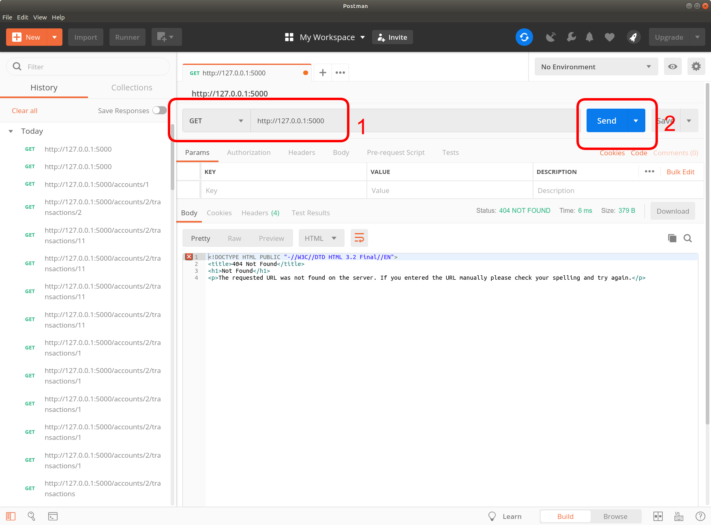
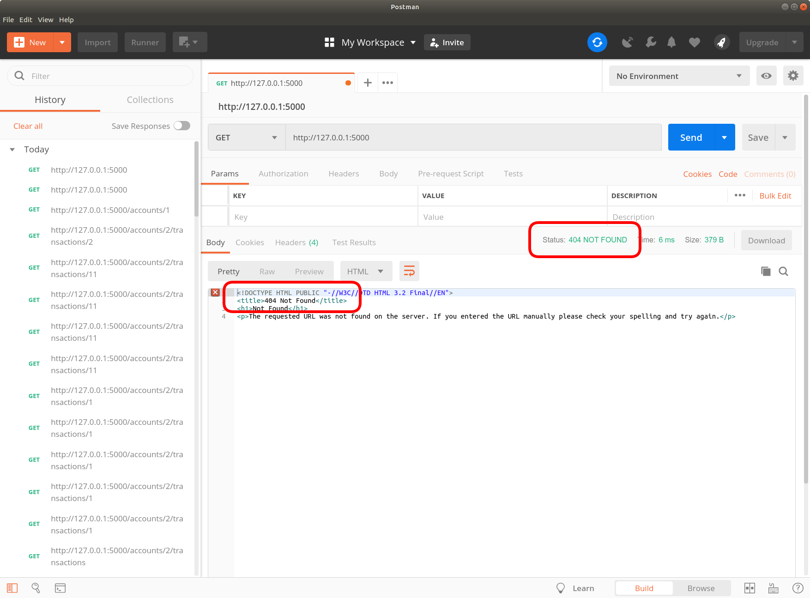
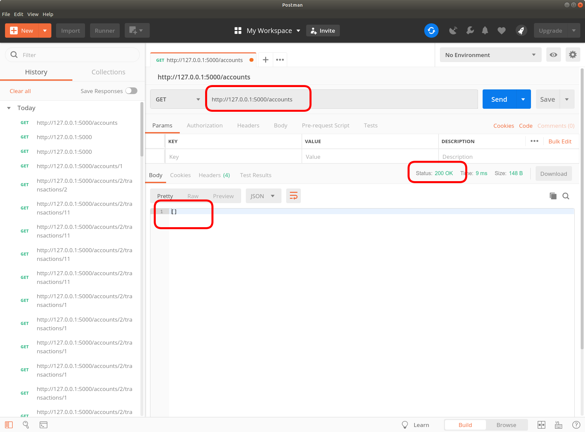
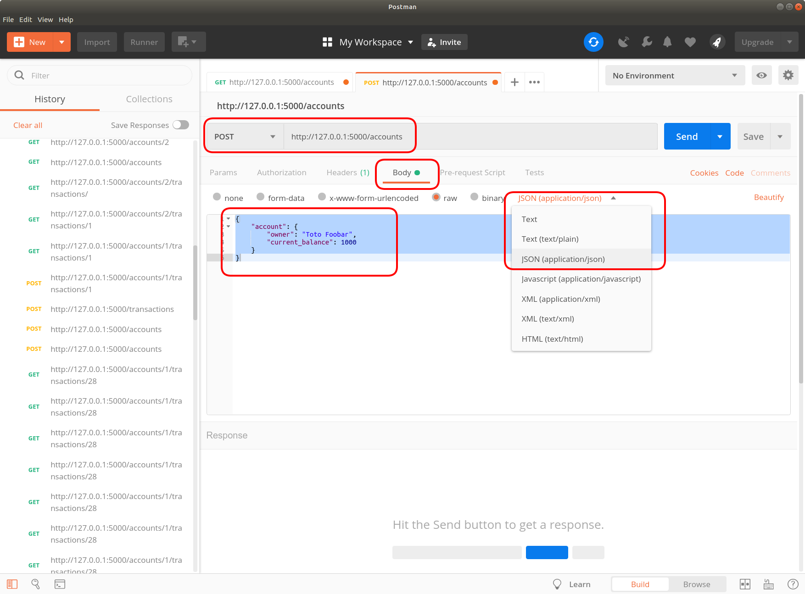
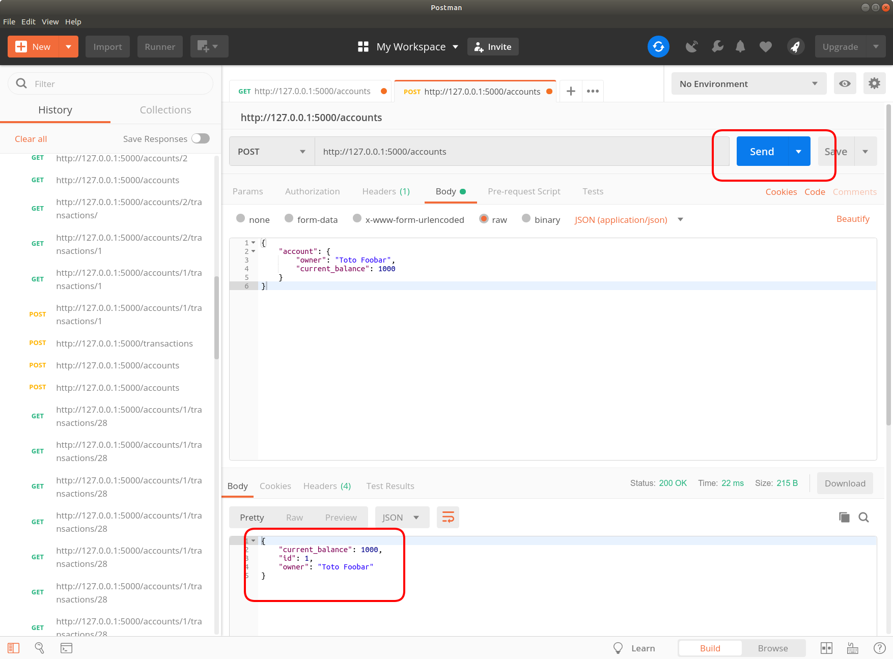

# Laboratoire 3

**Le laboratoire aura lieu dans le local PK-S1575**

## Projet de session

Assurez-vous de rejoindre le projet de session sur Github Classroom.

1. Créer un compte [Github](https://github.com) si ce n'est déjà pas le cas.
2. Rendez-vous sur la page du projet de session :
    [**https://classroom.github.com/g/oH9-4nj2**](https://classroom.github.com/g/oH9-4nj2)
3. Acceptez le travail, et identifier vous dans la liste en choisissant votre code permanent
    **Assurez-vous de ne pas prendre le code de quelqu'un d'autre!**
4. Créer une équipe individuelle, ou rejoignez l'équipe de votre collègue si vous faites la remise à 2.
5. Votre dépôt Github privé sera créé, vous pouvez commencer à l'utiliser.

## REST

Modéliser les routes, méthodes HTTP et un exemple de données JSON d'une API REST qui représente
l'emprunt de livres à un bibliothèque.

Les ressources sont :

* Un livre
* Un membre de la bibliothèque
* Les emprunts

Voici les routes à définir, avec deux exemples.

1. Créer un nouveau livre

    `POST https://api.example.com/bibliotheque/livre/`

    ```json
    {
        "livre": {
            "titre": "Release It!",
            "auteur": [
                "Michael T. Nygard"
            ],
            "edition": 2018,
            "copies": 3
        }
    }
    ```

2. Récupérer les emprunts d'un livre

    `GET https://api.example.com/bibliotheque/livre/10/emprunts`

    ```json
    {
        "emprunt": {
            "id": 42,
            "livre_id": 10,
            "membre_id": 25,
            "date_emprunt": "2019-09-25",
            "date_retour_prevu": "2019-10-02",
            "date_retour": null,
        }
    }
    ```

3. Créer un nouveau membre de la bibliothèque (avec nom, prénom, courriel)
4. Récupérer la liste des emprunts d'un livre
5. Récupérer la liste des livres actuellement empruntés par un membre
6. Étendre la date de retour prévu d'un livre emprunté par un membre
7. Marquer un livre comme retourné (ne pas supprimer l'emprunt)
8. Récupérer les membres qui ont un livre spécifique d'emprunté
9. Supprimer un livre

## API Rest

Dans le dossier [**flask**](./flask), il y a une application Flask représentant des comptes bancaires.

* Initialiser la base de donnée avec 
    ```
    FLASK_DEBUG=1 python -m flask init-db
    ```
* Rouler l'application avec
    ```
    FLASK_DEBUG=1 python -m flask run
    ```

L'objectif de cet exercice est de créer des requêtes manuelles pour interagir avec un API REST.

Il existe plusieurs outils, tel que les lignes de commandes `cURL`, HTTPie`. Pour cet exercice, je vais utiliser
`Postman`.

### Postman

1. Installer `Postman` localement à partir de l'adresse suivante : [https://www.getpostman.com/downloads/](https://www.getpostman.com/downloads/)
2. Ouvrer le logiciel. Il va vous demander de vous créer un compte. Vous pouvez aussi utiliser l'option de vous connecter
avec votre compte Google si vous en avez un.
3. À partir de Postman, tappez l'adresse de l'application flask du labo `http://127.0.0.1:5000` et appuyez sur Send

4. Vous remarquerez que ça retourne un 404. C'est normal, il n'y a aucune route d'index de définit!

5. Faites la même chose, mais pour l'adresse `http://127.0.0.1:5000/accounts`. Ça devrait vous retourner une liste JSON vide car il n'y a aucun compte encre.

6. Pour créer un compte, on va faire un POST de type JSON à `http://127.0.0.1:5000/accounts`. Le contenu du JSON sera :
```json
{
    "account": {
        "owner": "Toto Foobar",
        "current_balance": 1000
    }
}
```

7. Appuyer sur `Send`, et la requête va être envoyé à l'application Web. La réponse vous sera affiché.


### Exercice

1. Avec l'outils de votre choix, créer un autre compte appartenant à `John Smith` et avec une balance de 500
2. Créer une transaction à partir du premier compte vers le deuxième compte pour un montant de 100:
    ```json
    {
        "transaction": {
            "from_account": 1,
            "to_account": 2,
            "amount": 500
        }
    }
    ```
3. Récupérer toutes les transactions avec `GET /transactions`
4. Récupérer une seule transaction avec `GET /transactions/<int:id>` où `id` représente la dernière transaction (c'est surement `1`)
5. Récupérer toutes les transactions d'un compte avec `GET /accounts/<int:account_id>/transactions` (account_id est surement `1`)
