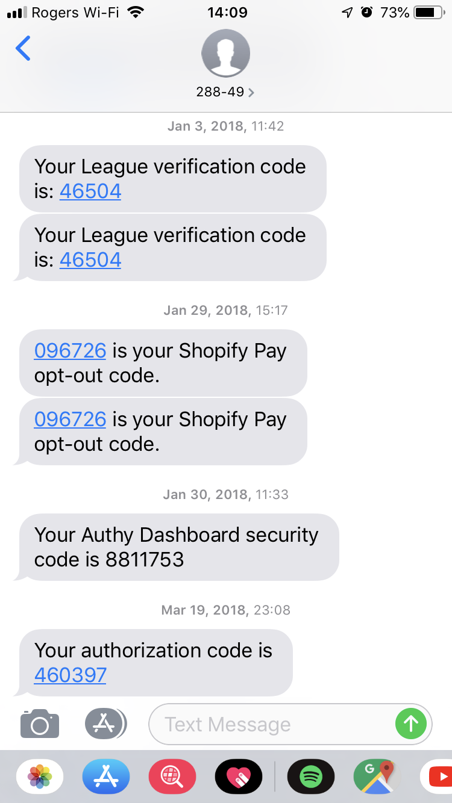

% INF5190 - Authentification et identification
% Jean-Philippe Caissy
% 2 octobre 2019

---
header-includes:
 - \usepackage{fvextra}
 - \DefineVerbatimEnvironment{Highlighting}{Verbatim}{breaklines,commandchars=\\\{\}}
---

# Identification

Objectif : informer l'identité d'un utilisateur/système/client/etc

Exemples d'identifications :

* Entrer son nom d'usager
* L'entête HTTP `User-Agent`
* Une carte de débit
* Une carte d'identité

L'identification est la première étape pour valider l'identité

# Authentification

Objectif : valider et vérifier l'identité fournie d'un utilisateur/système/client/etc

Exemples d'authentifications :

* Le mot de passe d'un identifiant
* Le NIP d'une carte de débit
* La validation de la photo et de la signature d'une carte d'identité

# Autorisation

Une fois l'identité fournie, et validé par une authentification cela permet de confirmer l'autorisation à une 
ressource

Exemple d'autorisation :

* Seul le propriétaire d'un compte bancaire peut y avoir accès
* Un administrateur peut posséder les autorisations nécessaire pour voir les courriels d'un membre de l'organisation

# Authentification
## Types

L'authentification d'une identité se fait à partir d'un des 4 éléments suivants :

* Connaissance

Seulement un utilisateur légitime peut connaître une information secrète que le système distant sait également. Par
exemple, un mot de passe, ou une question secrète.

* Possession

L'utilisateur possède un item pouvant validé son identité. Par exemple : une carte d'identité, une clé physique, une
carte d'accès (_key fob_), authentifieur à code uniques

* Identitaire

Aspects de l'utilisateur qui peut difficilement être forgé. Il s'agit surtout des identifications biométriques : 
emprunte digitale, l'iris des yeux, validation de la voie

# Authentification
## Multi-facteurs

* _single factor, two factor, multi-factor authentication_

On peut authentifier un identifiant avec un, ou plusieurs mécanismes d'authentification. Le nombre de mécanisme
d'authentifications utilités représente le nombre de facteurs utilisés.

* Facteur d'authentification unique

Valider l'identification avec un seul mécanisme d'authentification

* Facteur d'authentification double

Valider l'identification avec deux mécanismes d'authentifications

* Facteur d'authentification multiple

Valider l'identification avec plus de deux mécanismes d'authentifications

# Authentification
## Multi-facteurs

* Facteur d'authentification unique

Courrier UQÀM, n'importe quel formulaire de connexion avec seulement un identifiant et mot de passe

# Authentification
## Multi-facteurs

* Facteur d'authentification double

Se connecter à un site Internet avec nom d'usager et mot de passe (connaissance) et fournir un code unique envoyé
par texto (possession).

# Authentification
## Multi-facteurs

* Facteur d'authentification multiples

Une entrée de bâtiment nécessitant une carte d'accès (possession), un NIP (connaissance) et une emprunte digitale (identitaire)

# Authentification
## Forces

Il existe deux forces d'authentifications : **faible** et **fortes**.

**N.B. : une authentification forte n'est pas nécessairement une authentificaiton multi-facteurs**

* Faible

Une authentification faible représente un scénario où la force d'authentification est faible par rapport à
l'entité que l'authentification protège.

* Forte

À l'inverse, une authentification forte utilisera un ou plusieurs mécanismes d'authentifications afin
de protéger adéquatement l'entité derrière le système d'authentification.

# Authentification
## Mot de passe

* La combinaison identifiant / mot de passe est de loin le mécanisme d'authentification le plus populaire
pour une application Web.
* Le mot de passe est quelque chose que l'on connait, mais quel l'application distante doit connaître également
    * Le mot de passe doit donc être stocké par l'application Web

# Authentification
## Mot de passe

**Ne jamais stocker les mots de passes**

Jamais. Point final.

* Si l'application Web est compromise, un attaquant peut utiliser les informations d'identification et de mot de passe
pour s'authentifier en tant que n'importe quel utilisateur
* Beaucoup de gens ré-utilisent leur mot de passe à travers différentes applications

# Authentification
## Mot de passe

[`';--have i been pwned?`](https://haveibeenpwned.com/)

[https://haveibeenpwned.com/](https://haveibeenpwned.com/)

# Authentification
## Mot de passe
### Hashing

