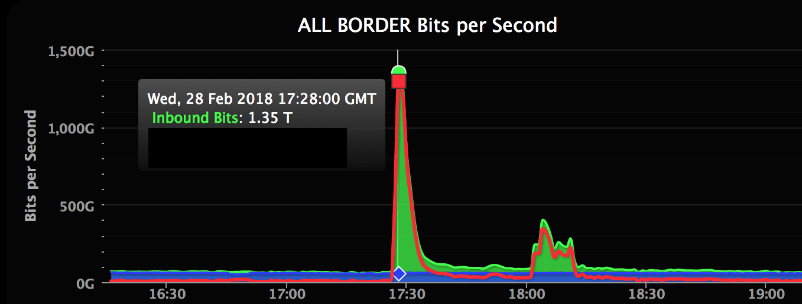
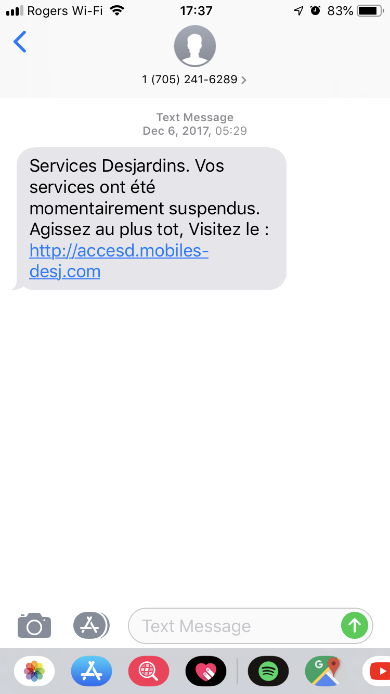
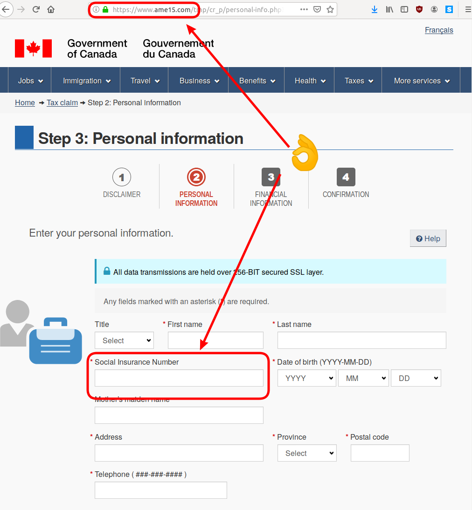

% INF5190 - Sécurité Web et patrons d'attaques
% Jean-Philippe Caissy
% 9 octobre 2019

---
header-includes:
 - \usepackage{fvextra}
 - \DefineVerbatimEnvironment{Highlighting}{Verbatim}{breaklines,commandchars=\\\{\}}
---

# Sécurité des systèmes d'information

Ensemble de mécanismes techniques, organisationnels, juridiques et humains pour empêcher :

* utilisation non-autorisé du système
* le mauvais usage
* la modification ou le détournement du système

# Sécurité des systèmes d'information
## Objectifs

* **Confidentialité**

    Accès limité aux personnes autorisés

* **Authentification**

    Prouver l'identité d'un système/usager

* **Intégrité**

    Données non altérés de façon illicite ou malveillante

* **Disponibilité**

    Accès permanent et sans faille aux ressources d'un système

# Sécurité des systèmes d'information
## Systèmes à risques

La prolifération des systèmes inter-connectés des deux dernières décennies rend la sécurité des systèmes d'information
plus complexe et encore plus important.

Systèmes à risques :

* Institutions financière
* Industries (télécommunications, aviation, énergie)
* Appareils de consommation (téléphone intelligent, tablettes, ordinateurs)
* Grande corporations
* Véhicules
* Gouvernements

Et bien plus encore

# Sécurité des systèmes d'information
## Démarche générale

La sécurité des systèmes d'informations est une démarche évolutive et sans fin. Lorsqu'un cycle de sécurisation est
complété, les démarches reprennent.

* Évaluation des risques et de l'importance

* Identifier les manières et actions pour se parer aux risques

* Mettre en place les protections et valider leur efficacité

# Cybersécurité
## Types d'attaques et de vulnérabilité
### Backdoor (porte dérobée)

Fonctionnalité inconnue d'un logiciel ou d'un algorithme permettant de contourner des mécanismes d'authentification
ou de sécurité en place.

* Peut avoir été introduit de manière légitime pour donner accès à un système (e.g.: mot de passe par défaut, fonctions de déboggage, etc)
* Possibilité de surveiller l'utilisateur à son insu et prendre le contrôle du système (e.g.: OS, application Web)

# Cybersécurité
## Types d'attaques et de vulnérabilité
### Backdoor (porte dérobée)

Exemples notoires :

* `Dual_EC_DRBG` : générateur de nombre aléatoire
* Noyau Linux (2003) : `sys_wait4`

```c
       if ((options == (__WCLONE|__WALL)) && (current->uid = 0))
                       retval = -EINVAL;
```

* ProFTPd (2010)

```c
if (strcmp(target, "ACIDBITCHEZ") == 0) { setuid(0); setgid(0); system("/bin/sh;/sbin/sh"); }
```

# Cybersécurité
## Types d'attaques et de vulnérabilité
### Déni de service (DoS, DDoS)

Objectif : rendre un système informatique indisponible au service et empêcher des utilisateurs légitimes de l'utiliser.

Habituellement, il s'agit d'envoyer trop de requête pour qu'un système ne puisse plus répondre aux requêtes légitimes.

# Cybersécurité
## Types d'attaques et de vulnérabilité
### Déni de service (DoS, DDoS)

Déni de service distribué (DDoS)

Les requêtes sont envoyé à partir de plusieurs sources.

Beaucoup plus difficile à bloquer car différencier les mauvaises requêtes des bonnes requêtes est très difficile.

#

{width=45%}

Source : [Everaldo Coelho and YellowIcon  - LGPL](https://commons.wikimedia.org/w/index.php?title=File:Stachledraht_DDos_Attack.svg&oldid=330975254)

# Cybersécurité
## Types d'attaques et de vulnérabilité
### Déni de service (DoS, DDoS)

Amplification : exploitation d'un protocole pour augmenter le trafique.

Exemple : envoyer un paquet à un service qui va envoyer 10 paquets (amplification 10x)

Souvent utilisé avec le protocole UDP

| Protocole | Facteur d'amplification |
|-----------|-------------------------|
| `Memcached` | 50000 |
| `NTP` |  556.9 |
| `DNS` | Jusqu'à 179 |
| `BitTorrent` | 4.0 à 54.3 |

# Cybersécurité
## Types d'attaques et de vulnérabilité
### Déni de service (DoS, DDoS)

Incident du 28 février 2018 : [https://github.blog/2018-03-01-ddos-incident-report/](https://github.blog/2018-03-01-ddos-incident-report/)

{width=70%}

* **1.35Tbps**
* **126.9 millions de paquets par seconde**

# Cybersécurité
## Types d'attaques et de vulnérabilité
### Attaques par accès direct

{width=30%}

Source : [Juan Pablo Olmo - CC BY 2.0](https://commons.wikimedia.org/w/index.php?title=File:Computer_locked.jpg&oldid=274469092)

# Cybersécurité
## Types d'attaques et de vulnérabilité
### Attaques par accès direct

Accès physique non autorisé à un système informatique.

* Contourne les mécanismes de sécurités en place
* Permet un accès direct aux données
* Le chiffrement des disques durs peut mitiger ce type d'attaque
* Ex: logiciel malveillant, dual-boot

# Cybersécurité
## Types d'attaques et de vulnérabilité
### Hameçonnage (phishing)

Principes et méthodes permettant d'acquérir des informations sensibles (mots de passe, carte de crédit, etc)
directement d'un utilisateur en le dupant.

Souvent fait à partir de SMS et de courriel.

# Cybersécurité
## Types d'attaques et de vulnérabilité
### Hameçonnage (phishing)



# Cybersécurité
## Types d'attaques et de vulnérabilité
### Hameçonnage (phishing)



# Cybersécurité
## Types d'attaques et de vulnérabilité
### Ingénierie sociale

@TODO


# Cybersécurité
## Types d'attaques et de vulnérabilité

### Escalade de privilège

Exploiter un bogue permettant à utilisateur d'accéder à des permissions administratives.

### Usurpation d'identité (spoofing)

Un système ou usager qui est en mesure de se faire passer pour un autre.

Ex : Adresse IP, entête `Referer`, numéro de téléphone

# Patrons d'attaques d'applications Web

Un patron d'attaque est une méthode, formule ou moyens pour contourner les mécanismes de sécurité en place d'une
application et qui décrit une attaque.

Il existe deux grandes catégories de patrons d'attaques :

* Injection
* Contournement d'authentification et de contrôles d'accès

# Patrons d'attaques d'applications Web
## Définitions

* **Vulnérabilité** : une faille ou une faiblesse dans un système informatique
* **Attaque** : Exploiter une vulnérabilité
* **Risque** : Probabilité qu'une attaque est lieu
* **Impact** : Les dommages, pertes et préjudices d'une attaque
* **Utilisateur malveillant** : un individu ou un groupe qui attaque un système
* **Vecteur d'attaque** : moyen ou direction qu'un attaquant utilise pour exploiter une vulnérabilité

# Patrons d'attaques d'applications Web
## Injection

Les failles d'injections se produisent lorsque des données non fiables sont envoyés à un interpréteur dans le
cadre d'une commande. Ces données non fiable peuvent

Types d'injections :

* SQL
* OS
* Variables d'environnements
* ORM
* etc

# Patrons d'attaques d'applications Web
## Injection SQL

Toutes les applications Web vont utiliser des données non fiable fournies par des utilisateurs. Ces données
vont être utilisé pour bâtir des requêtes dynamiques.

```python
email = request.POST['email']
query = """
    SELECT * FROM users
    WHERE email = '{0}'
""".format(email)
user = connection.execute(query).fetchone()
```

# Patrons d'attaques d'applications Web
## Injection SQL

`email = "caissy.jean-philippe@uqam.ca"`
```sql
    SELECT * FROM users
    WHERE email = 'caissy.jean-philippe@uqam.ca'
```

`email = "test'"`
```sql
    SELECT * FROM users
    WHERE email = 'test''
```

`email = "' or 1='1"`
```sql
    SELECT * FROM users
    WHERE email = '' or 1='1'
```

# Patrons d'attaques d'applications Web
## Injection SQL

`https://api.example.com/article?id=1`

```python
article_id = request.GET['id']
query = """
    SELECT * FROM articles
    WHERE id = {0} AND is_published = 1
""".format(article_id)
article = connection.execute(query).fetchone()
```

# Patrons d'attaques d'applications Web
## Injection SQL

`https://api.example.com/article?id=1`

```sql
SELECT * FROM articles
WHERE id = 1 AND is_published = 1
```


`https://api.example.com/article?id=321' -- `

```sql
SELECT * FROM articles
WHERE id = 321 -- AND is_published = 1
```

# Patrons d'attaques d'applications Web
## Injection SQL

```python
email = request.POST['email']
query = """
    DELETE FROM users
    WHERE email = '{0}'
""".format(email)
connection.execute(query)
```

# Patrons d'attaques d'applications Web
## Injection SQL

`email = "' or 1='1"`

```sql
DELETE FROM users
WHERE email = '' or 1='1'
```

# Patrons d'attaques d'applications Web
## Injection SQL

Conséquences d'une injection SQL :

* Vol de données
* Accéder, modifier et supprimer des données
* Atteindre des droits d'administrateurs sur la BD
* Lire des fichiers sur la BD

    MySQL : `LOAD DATA` 

# Patrons d'attaques d'applications Web
## Injection SQL

Mécanismes de prévention :

* Utiliser l'API de l'ORM
* Ne **jamais** passer des données non fiable : filtrer et échapper (escape) les données
* Utiliser des contrôles SQL pour limiter les enregistrements retournés, e.g.: `LIMIT`
    * Ceci permet de limiter les dégats

# Patrons d'attaques d'applications Web
## Injection de commandes

Similaire à l'injection SQL, l'injection de commande se fait lorsqu'on passe des données non faibles à des
appels système.

```python
import os

os.system("ls {0}".format(
    request.GET['dir']
))
```

# Patrons d'attaques d'applications Web
## Injection de commandes

`https://api.example.com/view?dir=.`

```bash
ls .
```

`https://api.example.com/view?dir=../`

```bash
ls ../
```

`https://api.example.com/view?dir=../;cat /etc/passwd`

```bash
ls ../; cat /etc/passwd
```

`https://api.example.com/view?dir=../;rm -rf /`

```bash
ls ../; rm -rf /
```

# Patrons d'attaques d'applications Web
## Contournement d'accès de contrôle

Les contrôle d'accès limitent l'accès à des ressources sur une application Web. Un contournement d'accès de contrôle
survient lorsqu'un utilisateur malveillant parvient à obtenir une ressource dont l'accès est limité.

Les deux manières les plus communes pour contourner l'accès à des données sont :

* XSS : Cross Site Scripting
* CSRF : Cross Site Request Forging


# Patrons d'attaques d'applications Web
## Contournement d'accès de contrôle
### XSS

Similaire aux attaques par injection, les attaques XSS injectent du code côté client (HTML/CSS/Javascript).

Conséquences graves :

* Vol de cookie
* Transfert de données secrète et privées

# Patrons d'attaques d'applications Web
## Contournement d'accès de contrôle
### XSS

Deux catégories de failles XSS :

* Non-persistés
    Le plus populaire. S'agit souvent de données fournies par des requêtes HTTP (GET ou POST)
* Persistés
    Plus dévastateur. Une application Web utilise une injection qui a été persité dans l'application

# Patrons d'attaques d'applications Web
## Contournement d'accès de contrôle
### XSS
#### Non-persités

```python
from flask import Flask, requset
app = Flask(__name__)

@app.route('/')
def hello_world():
    return '<h1>Hello, {0}!</h1>'.format(request.args.get('name'))
```

Exemple : [./exemple/xss.py](./exemple/xss.py)

# Patrons d'attaques d'applications Web
## Contournement d'accès de contrôle
### XSS
#### Persités

Exemple avec la station de vote : [../03-sept-18/exemples/station-de-vote/](../03-sept-18/exemples/station-de-vote/)

# Patrons d'attaques d'applications Web
## Contournement d'accès de contrôle
### XSS

Pour se protéger d'attaques de type XSS :

* Échapper (santize, escape) les données non fiables envoyés par l'utilisateur
* Cookies : HttpOnly
* Utiliser le Content Security Policy

# Patrons d'attaques d'applications Web
## Contournement d'accès de contrôle
### XSS

Échapper (escape) les entités HTML signifie afficher le code tel que prévu, et non pas les balises.

```html
<h1>Hello World</h1>
```

devient

```html
&lt;h1&gt;Hello World!&lt;/h1&gt;
```

# Patrons d'attaques d'applications Web
## Contournement d'accès de contrôle
### CSRF

Une attaque qui force un utilisateur connecté à exécuter des opérations sur une application Web sans qu'il s'en
rende compte.

Ne permet pas de voler de l'information car l'attaquant ne peut pas voir la réponse. Cette attaque vise
le changement d'état d'une application web.

# Patrons d'attaques d'applications Web
## Contournement d'accès de contrôle
### CSRF

Une application bancaire possède cet API pour effectuer un transfert :

```
GET https://bank.com/transfer?acct=BOB&amount=100
```

Un utilisateur malveillant veut pouvoir faire exécuter cette méthode à un individu déjà connecté a son compte de banque :

```
GET https://bank.com/transfer?acct=MARIA&amount=100
```

# Patrons d'attaques d'applications Web
## Contournement d'accès de contrôle
### CSRF

Une attaque de type CSRF implique généralement une attaque d'ingénierie sociale. L'objectif de Maria est de faire
exécuter la commande sur un utilisateur déjà connecté.

Exemple, créer une page Web et y inclure ce lien pour encourager la personne à visiter l'URL:

```html
<a href="https://bank.com/transfer?acct=MARIA&amount=100">
    Voir mes photos!
</a>
```

# Patrons d'attaques d'applications Web
## Contournement d'accès de contrôle
### CSRF

Une autre manière serait d'ajouter une image qui pointe vers cet URL!

```html

```


# Patrons d'attaques d'applications Web
## Contournement d'accès de contrôle
### CSRF

La seule différence entre une requête POST et une requête GET est comment l'attaque se fait.

```html
<form action="https://bank.com/transfer" method="POST">
<input type="hidden" name="acct" value="MARIA" />
<input type="hidden" name="amount" value="100000" />
<input type="submit" value="Voir mes photos!" />
</form>
```

# Patrons d'attaques d'applications Web
## Contournement d'accès de contrôle
### CSRF

En utilisant Javascript, on peut forcer le formulaire à se soumettre lorsque la page est chargée.

```html
<body onload="document.forms[0].submit()">
<form...
```

# Patrons d'attaques d'applications Web
## Contournement d'accès de contrôle
### CSRF

La seule manière de se protéger de ce type d'attaque est de :

* Utiliser un champ caché qui valide que l'utilisateur a visité la page
    * La plupart des frameworks offrent cette fonctionalité

@TODO exemple

# Sécurité d'applications web
## Protection
### Same Origin Policy

Mécanisme de sécurité critique limitant comment une page Web ou script peut interagir avec une autre origine.

Deux URLs ont la même origine si le **protocole**, le **port**, et le **domaine** sont les mêmes.

# Sécurité d'applications web
## Protection
### Same Origin Policy

Exemple pour une page Web qui est sur `https://caissy.dev/dir/page.html` :

| URL | Permis?
|--------------|------|----------------|
| `http://caissy.dev/dir2/autre.html` | Oui
| `http://caissy.dev/dir/autre.html` | Oui
| `https://caissy.dev/page.html` | Non
| `http://caissy.dev:81/dir/page.html` | Non
| `https://uqam.ca/page.html` | Non


# Sécurité d'applications web
## Protection
### Same Origin Policy

Pour permettre une requête sur une origine différente, on utilise le `Cross-Origin Resource Sharing` (CORS).

Il s'agit d'un entête HTTP permettant de spécifier au navigateur d'autres origines permises.

# Sécurité d'applications web
## Protection
### Content Security Policy

Spécification donnant les instructions au navigateur sur quels types de ressources et la localisation de celle-ci.

Supporté par la plupart des navigateurs aujourd'hui.

Le principe est de limiter les ressources chargées (images, CSS, JS, etc).

Exemple de limitation :

* Limiter au domaine actuel
* Limiter au domaine actuel et les sous domaines
* Seulement les ressources HTTPS
* Limiter les JS au domaine actuel, mais permettre les images sur tous les domaines
* etc

# Sécurité d'applications web
## Protection
### Content Security Policy

Le CSP est envoyé par le serveur Web dans un entête HTTP:

```
Content-Security-Policy: default-src 'self'
```

Ou dans une balise HTML `<meta>` :

```
<meta http-equiv="Content-Security-Policy"
    content="default-src 'self';" />
```

# Sécurité d'applications web
## Protection
### Content Security Policy

Démonstration !

# Sécurité d'applications web
## Protection
### Cookie

Rappel concernant les cookies : toujours transmettre le paramètre `Secure` et `HttpOnly`.

Avec le paramètre `HttpOnly`, le cookie ne sera pas disponible avec Javascript.

Exemple avec [./exemples/cookie.py](./exemples/cookie.py)

# Sécurité d'applications web
## OWASP Top 10

*Open Web Application Security Project* (OWASP) publie et garde à jour une liste des top 10 vulnérabilités dans
les applications web.

* [OWASP Top 10 (PDF)](https://www.owasp.org/images/7/72/OWASP_Top_10-2017_%28en%29.pdf.pdf)

# Sécurité d'applications web

Curieux d'en apprendre plus ?

* AGEEI : #securite et #secuqam sur le slack de l'AGEEI
* Compétitions : CS Games, Hackfest, NorthSec
    * L'AGEEI propose des défis de sécurité à résoudre : https://ctf.ageei.uqam.ca/

# Liens

* [What is a DDoS Attack?](https://www.cloudflare.com/learning/ddos/what-is-a-ddos-attack/)
* [OWASP Top 10](https://www.owasp.org/images/7/72/OWASP_Top_10-2017_%28en%29.pdf.pdf)
* [SQL Injection in INSERT Query](https://amolnaik4.blogspot.com/2012/02/sql-injection-in-insert-query.html)
* [Content Security Policy](https://developer.mozilla.org/en-US/docs/Web/HTTP/CSP)
