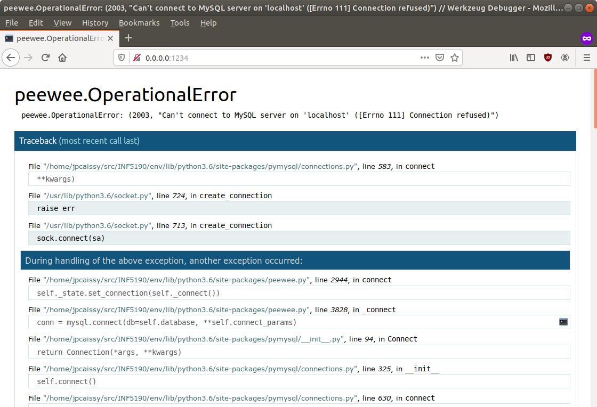
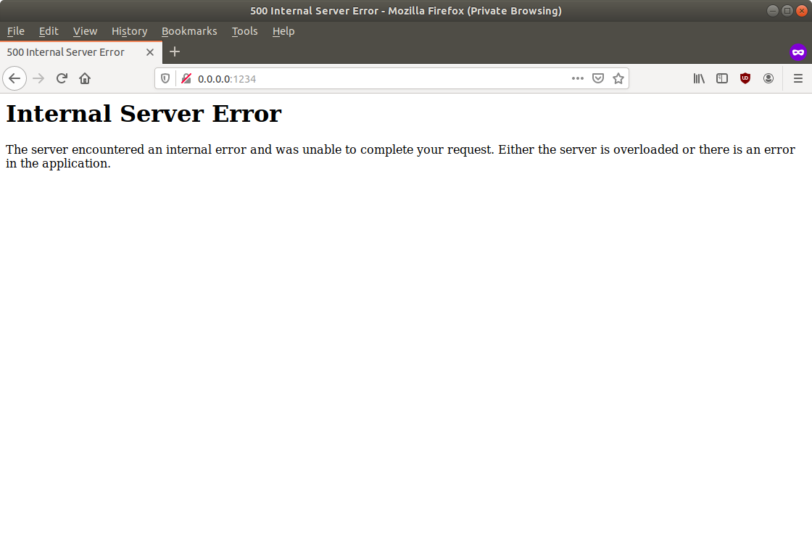
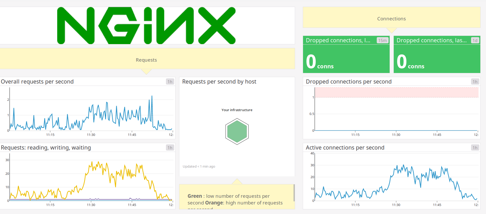

% INF5190 - Maintenance d'une application Web
% Jean-Philippe Caissy
% 13 novembre 2019

---
header-includes:
 - \usepackage{fvextra}
 - \DefineVerbatimEnvironment{Highlighting}{Verbatim}{breaklines,commandchars=\\\{\}}
---

#

Petit retour sur les défaillances en lien avec les déploiements et l'orchestration de conteneurs.

* Backblaze, une compagnie de sauvegarde (backup) sur le cloud a publié leur statistiques de défaillances de disques
durs pour le 3e trimestre de 2019 :
[www.backblaze.com/blog/backblaze-hard-drive-stats-q3-2019/](https://www.backblaze.com/blog/backblaze-hard-drive-stats-q3-2019/)

* À ce jour ils ont une défaillance de 1.73% de leurs disques durs pour l'année!

# Maintenance

La maintenance logiciel sont les changements apportés à un logiciel après qu'il ait été déployé/livré.

Les buts de la maintenance logiciel sont de :

* Corriger les bugs et fautes
* Améliorer les performances
* Ajouter, modifier ou supprimer des fonctionnalités

# Maintenance
## Détection de défaillances

* Dans un scénario idéal inexistant, une application Web fonctionne toujours sans erreur!
* Dans un environnement de développement, il est facile de détecter et travailler avec des exceptions

{width=70%}

# Maintenance
## Détection de défaillances

```bash
During handling of the above exception, another exception occurred:

Traceback (most recent call last):
  File "pymysql/__init__.py", line 94, in Connect
    return Connection(*args, **kwargs)
  File "pymysql/connections.py", line 325, in __init__
    self.connect()
  File "pymysql/connections.py", line 630, in connect
    raise exc
peewee.OperationalError: (2003, "Can't connect to MySQL server on 'localhost' ([Errno 111] Connection refused)")
```

# Maintenance
## Détection de défaillances

L'un des plus gros problèmes dans la détection de défaillance est la visibilité :

* Comment savoir que l'application répond aux requêtes?
* Comment récupérer les exceptions?
* Comment reproduire l'exception?

# Maintenance
## Détection de défaillances

{width=70%}

# Maintenance
### Surveillance

La surveillance d'un système (application Web) peut se regrouper en plusieurs catégories :

* Métriques opérationnelles
    * Performance et surveillance (*tracing*) applicative
    * ex : nombre de requêtes à la seconde, temps de réponse moyen, etc
* Gestion des logs
* Système d'alerte

Le tout est souvent regroupé en graphiques.

# Maintenance
### Surveillance
#### Métriques opérationnelles

Les métriques opérationnelles permettent de donner un aperçu instantané d'une application Web.

* Nombre de requêtes par unité de temps (minute, seconde)
* Proportions de requêtes HTTP avec statut 200, 300, 400 et 500
* Temps de réponse moyen d'une requête
* Nombre de requête par seconde sur une base de donnée
* Espace disque, RAM utilisé
* etc

**Objectif: avec un aperçu rapide, déterminer s'il y a une défaillance**

# Maintenance
### Surveillance
#### Métriques opérationnelles

Il existe plusieurs logiciel/compagnie pour visualier des métriques opérationnelles.

* Solutions payante et/ou géré: Datadog, Dynatrace, New Relic
* Solution open source: Graphite, Grafana, Prometheus

L'idée est simple : émettre une métrique, agréger sur une période de temps et persister le tout.

# Maintenance
### Surveillance
#### Métriques opérationnelles



# Maintenance
### Surveillance
#### Métriques opérationnelles

**StatsD** est un agrégateur de métriques.

* Protocole texte (simple!) avec UDP

```bash
echo "foo:1|c" | nc -u 127.0.0.1 8125
```

* Une application envoie les métriques à `StatsD`, qui les agrège et les envoient à un service distant pour persister.

# Maintenance
### Surveillance
#### Métriques opérationnelles

Types de métriques :

* Compteur
* Mesure de temps
* Jauge (valeur arbitraire)

Le tout peut être échantillonné (e.g.: utiliser une valeur sur 10)

Une métrique va contenir :

* Un nom
* Une valeur
* Zéro, un ou plusieurs *tag*

# Maintenance
### Surveillance
#### Métriques opérationnelles

Avec python :

```bash
$ pip install statsd-telegraf
```

`statsd-telegraf` permet d'ajouter des tags

# Maintenance
### Surveillance
#### Métriques opérationnelles

Exemple de compteur :

* Le nombre de requête HTTP, avec comme tag la valeur du statut HTTP retourné :

```python
statsd.increment(
    'http_request',
    tags=[
        'http_status:400',
        'controller:home',
        'production'
    ]
)
```
# Maintenance
### Surveillance
#### Métriques opérationnelles

Exemple de mesure de temps :

* Le temps pour retourner une réponse

```python
import time

@app.route("/")
def home():
    debut = int(time.time() * 1000) #milliseconds
    # faire quelque chose
    fin = int(time.time() * 1000)

    statsd.timing(
        'http_request.response_time',
        tags=['controller:home']
    )
```

# Maintenance
### Surveillance
#### Métriques opérationnelles

Le client Python de `StatsD` va automatiquement généré les métriques suivantes lorsqu'on mesure le temps :

* valeur minimale
* valeur maximale
* moyenne
* 90e percentile
* le nombre d'événement (compteur)


# Maintenance
### Surveillance
#### Métriques opérationnelles

Datadog possède une librairie Python qui intègre StatsD et des métriques pour Flask automatiquement!

```bash
$ pip install ddtrace
```

Avant l'instation de l'application Flask, il suffit d'ajouter

```python
from ddtrace import patch_all
patch_all()
```

# Maintenance
### Surveillance
#### Gestion des logs

* Lorsqu'une exception survient il faut capturer l'exception et la sauvegarder pour une analyse subséquente
    * Sauvegarder dans un fichier log, envoyer un courriel, envoyer vers un système de gestion de logs (Bugsnag, Logstash, etc)

* L'exception doit contenir le plus d'informations possible, sans compromettre la vie privée de l'utilisateur
    * Stacktrace applicative
    * Heure et date
    * Requête POST
    * URL complète
    * Session actuel, nom d'usager connecté, etc

* Il est important de filtrer les données sensibles :
    * Les mots de passes
    * Les cartes de crédits

# Maintenance
### Surveillance
#### Système d'alerte

Une fois que l'application est bien surveillé, on doit :

1. Définir les métriques à surveiller
2. Identifier un seuil critique
3. Définir et lancer un plan d'alerte

En fonction de l'importance du système et de la métrique, le plan d'alerte peut être :

* Rien!
* Création automatique d'un ticket
* Un simple courriel
* Une notification slack
* Un appel téléphonique

# Maintenance
## Surveillance

Comment corréler une requête (ce qu'un client voit) avec les logs d'une application Web (ce que le serveur voit) ?

@TODO Request ID

# Maintenance
## Surveillance

Cas d'utilisation : les slow request 

@TODO

# Maintenance
## Métriques d'acceptabilitéso

@TODO SLO

# Maintenance
## SRE

SRE : **Site Reliability Engineer** (ingénierie de la fiabilité d'un système)

* Discipline intégrant des aspects de l'ingénierie logiciel pour les appliquer à des problèmes d'infrastructures et
d'exploitation.

Citation de Ben Treynor, le fondateur de la première équipe de SRE chez Google :

> what happens when a software engineer is tasked with what used to be called operations.

# Maintenance
## SRE

Rôle d'un SRE:

* 50% du temps sur des problèmes opérationnel
    * bugs, interventions manuelles, diagnostiques d'urgences, astreinte (sur appel/*oncall*)
* 50% du temps sur du développement 
    * nouvelles fonctionnalités, mise à l'échelle (scaling), automation, etc

En général, les systèmes et applications qu'un SRE supervise sont automatisés et peuvent avoir des défaillances
sans interrompre le cheminement normal d'une application.

# Maintenance
## SRE

Les responsabilités des systèmes d'un SRE sont :

* Disponibilité
* Latence
* Performance
* Efficace
* Gestion des changements (e.g.: déploiements)
* Surveillance
* Diagnostiques d'urgences
* Planification des capacités du système

# Maintenance
## SRE

Les principes de bases de SRE sont :

* Accepter le risque
* SLO
* Éliminer les tâches lourdes

@TODO
