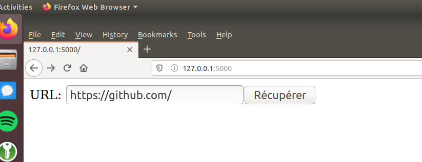

# Laboratoire 8

## Redis

Redis est une base de donnée de type clé-valeur. On peut persister des données primitives, mais Redis supporte
également des structure de données plus élaborées (hash, ordered set, etc).

Nous allons rouler Redis avec docker-compose, mais vous pouvez aussi le rouler localement (mac: `brew install redis`, ubuntu: `sudo apt-get install redis`, windows: https://github.com/dmajkic/redis/downloads).

L'image Docker que nous allons utiliser est celle disponible ici : [`https://hub.docker.com/_/redis`](https://hub.docker.com/_/redis)


`docker-compose.yml` :

```yml
version: "3"

services:
  cache:
    image: redis:latest
    restart: always
    ports:
      - '6379:6379'
    expose:
      - '6379'
```

Et `docker-compose up -d` pour partir le service :

```bash
$ sudo docker-compose up -d
Creating network "labo_default" with the default driver
Creating labo_cache_1 ...
Creating labo_cache_1 ... done
```

Nous allons également installer la librairie Python pour communiquer avec redis: https://github.com/andymccurdy/redis-py

```bash
$ pip install redis
```

Ouvrez une console python.

```python
from redis import Redis
redis = Redis.from_url("redis://localhost")
```

`redis` est notre connexion à Redis. Nous allons utiliser la commande [`set`](https://redis.io/commands/set) pour
mettre des données dans Redis.

```python
redis.set("cours", "inf5190")
```

La clé `cours` dans redis contient maintenant la valeur `inf5190`.

Pour récupérer la donnée :

```python
mon_cours = redis.get("cours")
print(mon_cours)
```

Vous remarquerez que `mon_cours` est un array de bytes, et non pas une string. C'est parce que Redis traite toutes les
données comme des bytes. Aucun entier, float, booléean. Tout est transformé en bytes.

Pour convertir en chaine de caractère valide utf-8:

```python
mon_cours.decode("utf-8")
```

On peut écraser la valeur :

```python
redis.set("cours", "hello")
redis.set("cours", "patate")
redis.set("cours", 5190)
```

La dernière valeur sera celle qui est retourné :

```
>>> print(redis.get("cours"))
b'5190'
```

N.B.: même si `5190` était un entier, Redis le convertis en bytes.

Il existe plusieurs opérations possibles sur les objets dans Redis.

```python
redis.set("mon-compteur", 0)
redis.incrby("mon-compteur")
redis.incrby("mon-compteur")
redis.incrby("mon-compteur", 5)
redis.incrby("mon-compteur", 10)
```

Quelle sera la valeur de `mon-compteur` ?

```python
>>> redis.get("mon-compteur")
b'17'
```

La commande `SET` permet de spécifier des expirations à la clé :

```
redis.set("cle-qui-va-expirer", "hello world!", ex=10)
```

La clé va exister pendant seulement 10 secondes.

```
>>> redis.set("cle-qui-va-expirer", "hello world!", ex=10)
True
>>> redis.get("cle-qui-va-expirer")
b'hello world!'
>>> redis.get("cle-qui-va-expirer")
b'hello world!'

[.....] 10 secondes plus tard

>>> redis.get("cle-qui-va-expirer")
>>> redis.get("cle-qui-va-expirer")
>>> redis.get("cle-qui-va-expirer")
```

Une liste complète des commandes Redis est disponible ici : https://redis.io/commands et la librairie Python tente
d'utiliser les mêmes nom pour les commandes : https://redis-py.readthedocs.io/en/latest/

Les structures de données accessible en Redis sont ici : https://redis.io/topics/data-types

---

## Caching

Nous allons créer une petite application Flask qui récupère une page Internet et la persister dans Redis.

Créer un fichier `cache.py` et lancer flask

```python
import urllib.request
from flask import Flask, request, redirect, url_for
from redis import Redis

redis = Redis.from_url("redis://localhost")

app = Flask(__name__)

@app.route("/", methods=['GET'])
def index():
    return """<form method="post">URL: <input name="url" type="text" /><button type="submit" />Récupérer</button></form>"""

@app.route("/", methods=['POST'])
def show_page():
    url = request.form['url']

    return fetch_page(url)

def fetch_page(url):
    with urllib.request.urlopen(url) as f:
        page = f.read().decode('utf-8')

    return page
```

```
$ FLASK_DEBUG=true FLASK_APP=cache flask run
 * Serving Flask app "cache" (lazy loading)
 * Environment: production
   WARNING: This is a development server. Do not use it in a production deployment.
   Use a production WSGI server instead.
 * Debug mode: on
 * Running on http://127.0.0.1:5000/ (Press CTRL+C to quit)
 * Restarting with stat
 * Debugger is active!
 * Debugger PIN: 137-450-813
```

Prenez un URL, et cliquer sur le bouton `Récupérer`!



### Exercice

1. Modifiez l'application pour persister la page dans Redis. Si la page existe, retournez la valeur qui est dans la cache.
    * indice : vous pouvez utiliser une clé qui correspond à l'url!
2. Rajouter une option pour forcer l'application à récupérer la page même si elle est déjà dans la cache.
3. Avec l'option `ex` de `SET`, expirer la cache après 30 secondes

Solution : [cache.py](./cache.py)

---

## Tâche en arrière plan

Nous allons reprendre l'application Flask de base :

```python
import urllib.request
from flask import Flask, request, redirect, url_for
from redis import Redis

redis = Redis.from_url("redis://localhost")

app = Flask(__name__)

@app.route("/", methods=['GET'])
def index():
    return """<form method="post">URL: <input name="url" type="text" /><button type="submit" />Récupérer</button></form>"""

@app.route("/", methods=['POST'])
def show_page():
    url = request.form['url']

    return fetch_page(url)

def fetch_page(url):
    with urllib.request.urlopen(url) as f:
        page = f.read().decode('utf-8')

    return page
```
L'objectif de cet exercice est d'extraire la composante responsable de faire la requête HTTP dans un système de tâche.

Pour ce faire nous allons utiliser `RQ` (redis queue) : https://python-rq.org/

Il s'agit d'un gestionnaire de tâche très simple.

1. Installez la librairie:

```bash
pip install rq
```

2. Dans votre application Python, créez une première file d'attente (*queue*)

```python
from redis import Redis
from rq import Queue

redis = Redis.from_url("redis://localhost")
queue = Queue(connection=redis)
```

3. Ensuite modifiez le contrôleur `show_page` pour mettre la commande dans la liste des tâches à exécuter par le *worker*

```python
    job = queue.enqueue(fetch_page, url)
```

```python
@app.route("/", methods=['POST'])
def show_page():
    url = request.form['url']

    job = queue.enqueue(fetch_page, url)

    return "La page est en train d'être récupérée"
```

Évidemment, cela veut dire que nous n'aurons pas le contenu de la page immédiatement. Il faut donc afficher une
page intermédiaire tant que le travail n'a pas été fait par le gestionnaire de tâche.

4. Lorsqu'une job est mise dans la file, `RQ` retourne un `job id`. Nous pouvons utiliser cette identifiant pour
vérifier si la job est prête ou pas. Pour ce faire nous devons rediriger vers une nouvelle route

```python
@app.route("/", methods=['POST'])
def show_page():
    url = request.form['url']

    job = queue.enqueue(fetch_page, url)
    return redirect(url_for('fetch_page', job_id=job.id))

@app.route("/<string:job_id>")
def verify_job(job_id):
    return
```

5. Dans le contrôleur `verify_job`, on peut vérifier si job est terminée avec `Job.is_finished`

```python
@app.route("/<string:job_id>")
def verify_job(job_id):
    job = queue.fetch_job(job_id)
    if not job.is_finished:
        return "La job n'est toujours pas terminée"
```

6. Une fois que la job est terminée, on peut récupérer le résultat de celle-ci (la page web!)

```python
@app.route("/<string:job_id>")
def verify_job(job_id):
    job = queue.fetch_job(job_id)
    if not job.is_finished:
        return "La job n'est toujours pas terminée"

    return job.result
```

7. Malheureusement nos jobs ne sont pas exécutés par le gestionnaire de tâche. À partir de la racine, vous pouvez lancer
la commande `rq worker` :

```bash
$ rq worker
15:02:51 Worker rq:worker:29d25f6e5448490fb423e537a845df0e: started, version 1.1.0
15:02:51 *** Listening on default...
15:02:51 Cleaning registries for queue: default
15:02:51 default: tache.fetch_page('https://github.com/') (4c95f4fd-3311-4f2b-bf6f-eb63d4412633)
15:02:52 default: Job OK (4c95f4fd-3311-4f2b-bf6f-eb63d4412633)
15:02:52 Result is kept for 500 seconds
15:02:52 default: tache.fetch_page('https://github.com/') (7905c473-a47a-40b3-b88b-08679e59956f)
15:02:53 default: Job OK (7905c473-a47a-40b3-b88b-08679e59956f)
15:02:53 Result is kept for 500 seconds
15:02:53 default: tache.fetch_page('https://github.com/') (3b9195d8-1ed7-4426-a858-3afe59397c9d)
15:02:53 default: Job OK (3b9195d8-1ed7-4426-a858-3afe59397c9d)
15:02:53 Result is kept for 500 seconds
```

Une alternative c'est d'utiliser les commandes flask avec `click`:

```python
import click
from rq import Queue, Worker

@app.cli.command("worker")
def rq_worker():
    worker = Worker([queue], connection=redis)
    worker.work()
```

Et de rouler directement avec `flask worker`

8. Par contre, les résultats des tâches de `RQ` expirent après 500 secondes. Nous voulons les persister ailleurs pour
y avoir accès. Essayons avec Redis!

```python
def fetch_page(url):
    with urllib.request.urlopen(url) as f:
        page = f.read().decode('utf-8')

    cache_key = "url-{0}".format(url)
    redis.set(cache_key, page)

    return page
```

---

Solution : [`tache.py`](./tache.py)

Avec `tache.py`, vous pouvez rouler l'application flask:

```bash
FLASK_DEBUG=true FLASK_APP=tache flask run
```

et rouler le worker avec `flask worker`:

```bash
FLASK_DEBUG=true FLASK_APP=tache flask worker
```
